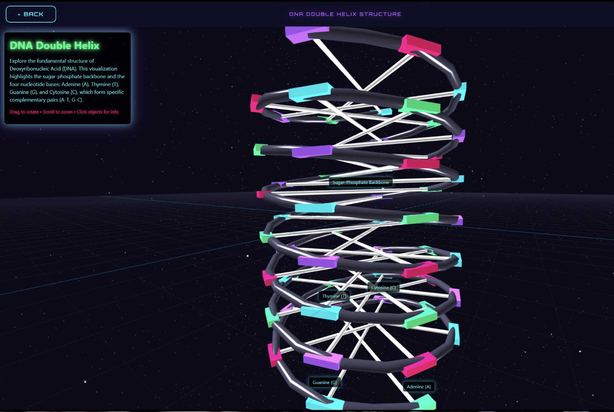
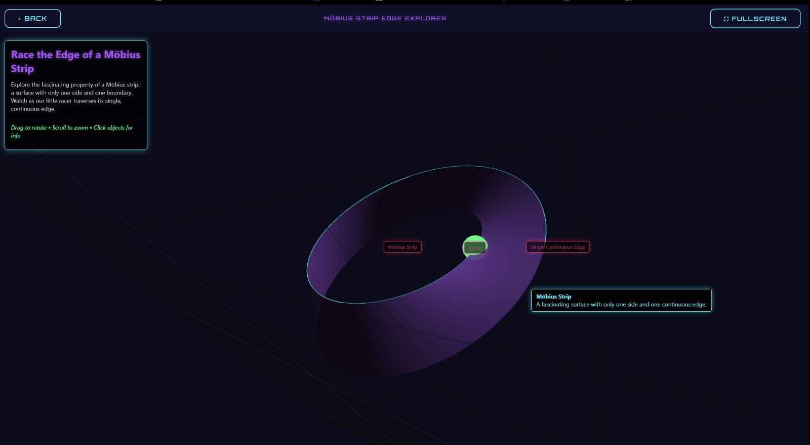

# Cognitive 3D Learning AI

> **Multiplayer adaptive learning platform powered by AI performance prediction, Elo-based matchmaking, and real-time 3D visualizations.**

---

## What It Does

Most digital learning tools deliver static content regardless of how a user is actually performing. **Cognitive 3D Learning AI** solves that by:

- Continuously tracking player cognitive performance across sessions
- Running a real-time AI pipeline to predict optimal challenge difficulty
- Matching players of similar trajectories using a custom Elo rating engine
- Rendering complex educational concepts as live, interactive 3D modules in the browser

The result is a self-adjusting learning loop that prevents cognitive overload and improves long-term retention through gamified competition.

---

## 3D Learning Modules

The platform auto-generates immersive WebGL-based modules tied directly to cognitive outcomes.

| DNA Double Helix | Mobius Strip Explorer |
|:---:|:---:|
|  |  |
| *Molecular bonds and base-pair complementarity* | *Single-edge continuous surface topology* |

---

## AI Pipeline

`
User Session
     |
     v
MongoDB sessionVector  <-- tracks scores, time, accuracy per game
     |
     v
Feature Extraction
  - avgLast5, avgLast10, avgLast25   (sliding window averages)
  - Trend slope via Linear Regression on recent N games
  - Variance score (consistency measure)
     |
     v
Prediction Engine  (lib/prediction.js)
  - Exponential Weighted Moving Average  (alpha=0.3)
  - Linear Regression: y = b0 + b1 * x
  - Variance guard: high-variance players regress toward global mean
     |
     v
Predicted Next Score  --->  Difficulty Tier Selection
     |
     v
Elo Rating Update  (lib/elo.js)
  - Dynamic K-factor: K=40 (new) / K=30 (intermediate) / K=20 (veteran)
  - Placement scoring: actualScore = (n - placement) / (n - 1)
  - Expected score: E = 1 / (1 + 10^((EloB - EloA) / 400))
     |
     v
Matchmaking  --->  Real-time Arena via Socket.io
`

### Prediction Formula

`
PredictedScore = (avgLast5 * 0.5) + (avgLast10 * 0.3) + (avgLast25 * 0.2) + (trend * 5)

If variance > 1000:
    PredictedScore = PredictedScore * 0.7 + global_mean * 0.3
`

Recent performance dominates with weight 0.5, while trend and variance corrections stabilize predictions for inconsistent players.

---

## Database Integration

| Model | Role |
|---|---|
| User | Auth credentials, bcrypt-hashed passwords, JWT sessions |
| PlayerStats | sessionVector[] — time-series of per-game cognitive metrics |
| GameSession | Game snapshots: scores, placements, Elo deltas |
| ArenaRoom | Multiplayer room state, live player roster, Socket.io sync |

- **MongoDB + Mongoose** — flexible schema-validated document storage
- sessionVector is the central structure feeding the AI pipeline on every game completion
- Stateless JWT auth with bcrypt hashing — no plaintext credentials stored

---

## Tech Stack

| Layer | Technology |
|---|---|
| Backend | Node.js, Express |
| Real-time | Socket.io (WebSockets) |
| AI / Math | Custom Linear Regression, EWMA, Elo Rating |
| Database | MongoDB, Mongoose |
| Frontend | HTML5, CSS3, Canvas API, WebGL |
| Auth | JWT, bcryptjs |
| DevOps | Docker, Vercel |

---

## Quick Start

`ash
git clone https://github.com/shikharuniyal/cognitive-3d-learning-ai.git
cd cognitive-3d-learning-ai
cp .env.example .env
npm install
npm start
`

Server runs on http://localhost:3000

---

*Built by [Shikhar Uniyal](https://github.com/shikharuniyal)*
